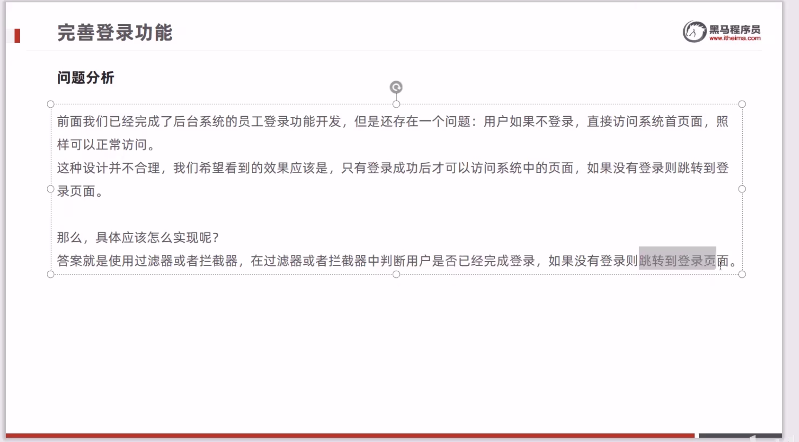
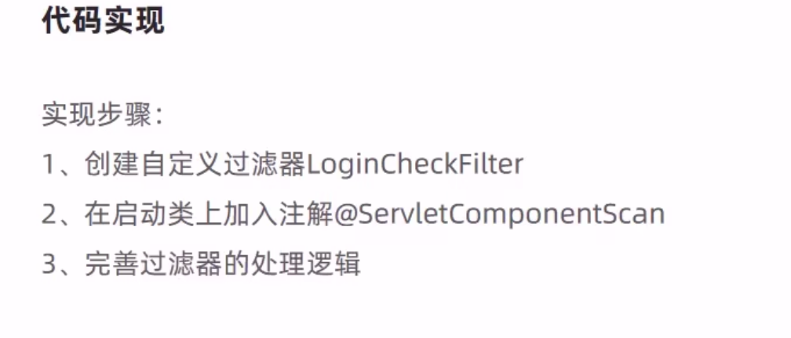

## Day1
### 登陆功能
##### MSC
- Dao是ssm框架基于JDBC的，需要在Impl中实现具体函数。Mapper是Mybatis的，只需要接口映射xml就可以

##### 通用结果类
- 不注入实现类是为了解耦合

##### 登陆方法

## Day2
### 员工管理
##### 拦截器
- 登陆成功才能访问,否则跳转到登陆页面
- 用拦截器的时候要注意放行静态资源噢

##### 新增员工

##### 分页查询

##### 启用禁用

##### 编辑员工

## Day3
##### 公共字段填充
知识:
1. 客户端每发一个http请求, 服务端会新增一个线程处理
2. Thread为每个线程提供一个独立的空间

TODO:
- [ ] 将httpservletrequest注入就能在metaObjectHandler里获取session对象?
- [ ] ThreadLocal里加一个remove放置内存泄漏?
